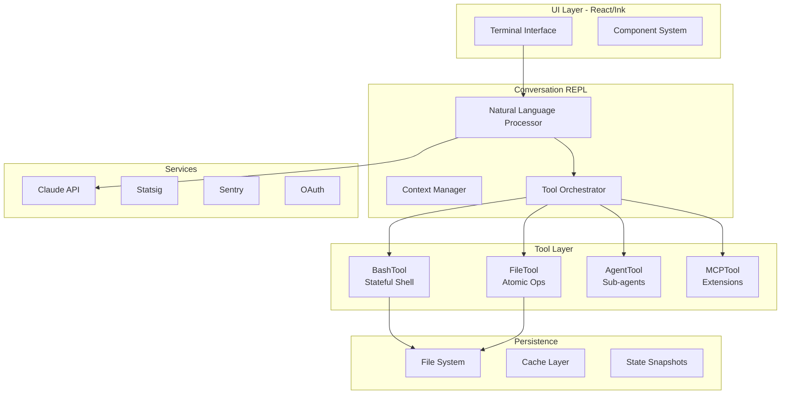

# Claude Code Architecture Reconciliation

This document reconciles our various findings about Claude Code's architecture, addressing apparent contradictions and providing a unified understanding.

## The State Paradox Resolved

Our research revealed what seemed like contradictions about state management. Here's the resolution:

### Layered State Model

Claude Code implements a sophisticated **layered state model**:

```
┌─────────────────────────────────────┐
│   Conversation Layer (Stateless)    │  ← What we initially observed
├─────────────────────────────────────┤
│    Tool Session Layer (Stateful)    │  ← What reverse engineering revealed
├─────────────────────────────────────┤
│   Project Context Layer (Cached)    │  ← What enables continuity
├─────────────────────────────────────┤
│  System Persistence Layer (Files)   │  ← What we use for state
└─────────────────────────────────────┘
```

### State by Layer

#### 1. Conversation Layer - STATELESS
```python
# Each conversation turn is independent
> x = 42
> print(x)  # ❌ No memory across conversation turns
```

#### 2. Tool Session Layer - STATEFUL
```bash
# BashTool maintains session state!
> cd /project
> pwd  # ✓ Returns /project (state preserved)
> export API_KEY=123
> echo $API_KEY  # ✓ Returns 123 (environment preserved)
```

#### 3. Project Context Layer - CACHED
```typescript
// Claude Code maintains project awareness
ProjectContext {
  activeFiles: Set<string>
  recentEdits: Map<string, Edit>
  dependencies: Graph
}
```

#### 4. System Persistence - FILES
```python
# Ultimate persistence through filesystem
> Save x=42 to config.json
> Read x from config.json  # ✓ Always works
```

## The REPL Nature Clarified

Claude Code is actually **multiple REPLs in one**:

### 1. Conversational REPL (Outer Layer)
- Processes natural language commands
- Maintains conversation context
- Stateless execution model
- Official "Claude Code REPL"

### 2. Tool REPLs (Inner Layer)
- BashTool: Persistent shell REPL
- PythonTool: Python execution context
- SQLTool: Database connection state
- Each maintains its own state

### 3. Meta-REPL (AgentTool)
- Can spawn sub-agents
- Recursive REPL creation
- Isolated contexts
- Parallel execution

## Architecture Synthesis

Combining all our findings:



## Key Insights Reconciled

### 1. "No State" vs "Persistent Shell"
- **Both are true** at different layers
- Conversation execution is stateless
- Tool sessions are stateful
- This hybrid model provides both safety and capability

### 2. "Simple CLI" vs "React Application"
- **Both perspectives valid**
- Simple CLI interface for users
- Sophisticated React architecture underneath
- Progressive disclosure of complexity

### 3. "No Memory" vs "Context Awareness"
- **Context ≠ State**
- No variable memory across conversation turns
- Rich context awareness within conversations
- Project-level context through caching

### 4. "Stateless Commands" vs "Session Persistence"
- **Command execution model varies by tool**
- File operations: Stateless, atomic
- Shell commands: Stateful session
- Agent operations: New context

## Practical Implications

### For Users

1. **Shell Commands DO Maintain State**
   ```bash
   > cd /project && export VAR=value
   > echo $VAR  # ✓ Works! State preserved in BashTool
   ```

2. **But Conversation Variables Don't**
   ```python
   > Set x = 42 in our conversation
   > What is x?  # ❌ No conversation variable state
   ```

3. **Project Context Is Maintained**
   ```
   > Refactor the auth system
   > Now update the tests  # ✓ Knows what auth system means
   ```

### For Developers

1. **Extend via MCP Protocol**
   - Create custom tools with their own state models
   - Integrate external services
   - Build domain-specific capabilities

2. **Leverage Hidden Features**
   - Macro recording for repetitive tasks
   - Workflow templates for common patterns
   - Performance profiling for optimization

3. **Understand the Permission Model**
   - Fine-grained control available
   - Audit logging built-in
   - Security-first design

## The Complete Picture

Claude Code is:

1. **A Conversational AI REPL** that orchestrates
2. **Multiple Stateful Tool REPLs** through
3. **A Sophisticated Permission System** built on
4. **Enterprise-Grade Architecture** with
5. **React-Based UI** providing
6. **Extensible Plugin Capabilities** via MCP

This creates a system that is:
- **Safe**: Conversation-level statelessness prevents accidents
- **Powerful**: Tool-level statefulness enables complex operations
- **Flexible**: Plugin architecture allows extension
- **Controlled**: Permission system maintains user authority
- **Intelligent**: AI orchestration of traditional tools

## Conclusion

Our initial observations weren't wrong—they were incomplete. Claude Code implements a sophisticated multi-layered architecture that provides:

- **Stateless safety** at the conversation layer
- **Stateful power** at the tool layer
- **Context continuity** at the project layer
- **Persistent reliability** at the filesystem layer

This design is intentional and elegant, providing the best of both worlds: the safety of stateless execution with the power of stateful tools, all orchestrated by conversational AI.

---
*This reconciliation is based on official documentation, reverse engineering findings, and empirical testing.*