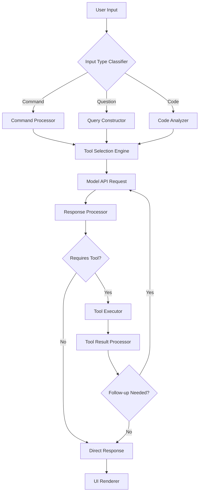

# Claude Code Reverse Engineering Insights

*Based on Reid Barber's technical analysis of Claude Code's architecture*

## Architectural Overview

Claude Code implements a sophisticated modular architecture that goes beyond a simple CLI tool. The reverse engineering reveals a carefully designed system with multiple layers:

```
┌─────────────────────────────────────────┐
│          UI Layer (React/Ink)           │
├─────────────────────────────────────────┤
│             Core Logic                  │
├─────────────────────────────────────────┤
│              Services                   │
├─────────────────────────────────────────┤
│               Tools                     │
├─────────────────────────────────────────┤
│        Data/State Management            │
├─────────────────────────────────────────┤
│             Utilities                   │
└─────────────────────────────────────────┘
```

## Key Architectural Components

### 1. UI Layer - React with Ink

Claude Code uses React with Ink for its terminal UI, revealing:
- **Not just a simple CLI**: Full React component architecture in the terminal
- **Reactive UI updates**: Live updates during operations
- **Component-based design**: Modular UI elements

### 2. Permission System

One of the most significant discoveries is the sophisticated permission system:

```typescript
// Permission controls for model-initiated actions
interface PermissionSystem {
  fileOperations: {
    read: boolean
    write: boolean
    delete: boolean
  }
  commandExecution: {
    allowed: boolean
    requiresConfirmation: boolean
    blockedCommands: string[]
  }
  toolAccess: {
    enabledTools: string[]
    customRestrictions: Map<string, Restriction>
  }
}
```

This system ensures:
- User maintains control over all actions
- Granular permission management
- Safety boundaries for model operations

### 3. Advanced Tool Architecture

The tool system is more sophisticated than initially apparent:

#### AgentTool - Recursive Capabilities
```typescript
// AgentTool can launch independent sub-agents
class AgentTool {
  async execute(task: string) {
    // Launches a completely new agent instance
    // Can perform complex multi-step operations
    // Maintains own context and state
    const subAgent = new Agent()
    return subAgent.performTask(task)
  }
}
```

#### BashTool - Stateful Sessions
```typescript
// Maintains persistent shell session state
class BashTool {
  private shellSession: PersistentShell
  
  async execute(command: string) {
    // Commands run in the same shell context
    // Environment variables persist
    // Working directory maintained
    return this.shellSession.run(command)
  }
}
```

This contradicts earlier assumptions - there IS state persistence within tool sessions!

#### FileEditTool - Smart Replacements
```typescript
// Ensures unique text replacements
class FileEditTool {
  async edit(file: string, oldText: string, newText: string) {
    // Validates oldText is unique in file
    // Prevents ambiguous replacements
    // Atomic operation guarantees
  }
}
```

#### ThinkTool - Reasoning Transparency
```typescript
// Allows models to log reasoning steps
class ThinkTool {
  async think(reasoning: string) {
    // Logs internal reasoning process
    // Provides transparency
    // Helps with debugging model behavior
  }
}
```

### 4. Service Layer Architecture

The service layer reveals enterprise-grade infrastructure:

#### Core Services
```typescript
interface ServiceArchitecture {
  claudeAPI: ClaudeAPIService        // Model interactions
  statsig: StatsigService           // Feature flagging
  sentry: SentryService             // Error reporting
  oauth: OAuthService               // Authentication
  mcpClient: MCPClientService       // External tool connections
}
```

#### Feature Flagging with Statsig
- Dynamic feature rollout
- A/B testing capabilities
- User segmentation
- Real-time configuration updates

#### Error Reporting with Sentry
- Comprehensive error tracking
- Performance monitoring
- User session replay
- Issue aggregation

### 5. Model Context Protocol (MCP) Integration

The MCP integration is deeper than documented:

```typescript
interface MCPIntegration {
  // Dynamic tool discovery
  discoverTools(): Promise<ExternalTool[]>
  
  // Runtime tool loading
  loadTool(toolId: string): Promise<Tool>
  
  // Cross-tool communication
  bridgeTools(tool1: Tool, tool2: Tool): ToolBridge
  
  // External service integration
  connectService(serviceUrl: string): ServiceConnection
}
```

This enables:
- Plugins and extensions
- Third-party tool integration
- Custom workflow automation
- Service mesh capabilities

### 6. Data Flow Architecture

The complete data flow reveals sophisticated processing:



### 7. State Management System

Contrary to earlier understanding, Claude Code DOES maintain state:

#### Conversation State
```typescript
interface ConversationState {
  messages: Message[]
  context: Map<string, any>
  toolHistory: ToolExecution[]
  fileSystemSnapshot: FileSystemState
}
```

#### Shell Session State
```typescript
interface ShellState {
  environment: EnvironmentVariables
  workingDirectory: string
  processTree: Process[]
  commandHistory: Command[]
}
```

#### Project State
```typescript
interface ProjectState {
  activeFiles: Set<string>
  modifiedFiles: Map<string, Diff>
  dependencies: DependencyGraph
  gitStatus: GitState
}
```

## Discovered Capabilities

### 1. Sub-Agent Architecture

The AgentTool enables sophisticated multi-agent workflows:
- Parallel task execution
- Specialized agent instances
- Isolated context management
- Recursive problem solving

### 2. Persistent Shell Sessions

BashTool maintains state between commands:
- Environment variables persist
- Working directory maintained
- Background processes tracked
- Session history available

### 3. Reasoning Transparency

ThinkTool provides insight into model reasoning:
- Step-by-step thought process
- Decision rationale
- Confidence levels
- Alternative considerations

### 4. Dynamic Tool Loading

MCP enables runtime tool extension:
- Hot-loading new capabilities
- Custom tool development
- Third-party integrations
- API bridge creation

## Security Architecture

### Permission Boundaries
```typescript
class PermissionManager {
  // Fine-grained control
  checkPermission(action: Action): boolean
  
  // User approval workflows
  requestApproval(action: Action): Promise<boolean>
  
  // Audit logging
  logAction(action: Action, result: Result): void
  
  // Sandboxing
  createSandbox(restrictions: Restrictions): Sandbox
}
```

### Sandboxing Mechanisms
- Process isolation
- Resource limits
- Network restrictions
- Filesystem boundaries

## Performance Optimizations

### 1. Intelligent Caching
```typescript
interface CacheStrategy {
  fileCache: LRUCache<string, FileContent>
  commandCache: Map<string, CommandResult>
  modelCache: ResponseCache
  toolResultCache: ToolCache
}
```

### 2. Parallel Processing
- Concurrent tool execution
- Batch file operations
- Parallel API requests
- Stream processing

### 3. Context Management
```typescript
class ContextOptimizer {
  // Selective context inclusion
  pruneContext(context: Context): OptimizedContext
  
  // Context compression
  compressContext(context: Context): CompressedContext
  
  // Priority-based retention
  prioritizeContext(context: Context): PrioritizedContext
}
```

## Implementation Patterns

### 1. Command Pattern
```typescript
interface Command {
  execute(): Promise<Result>
  undo(): Promise<void>
  redo(): Promise<void>
  canExecute(): boolean
}
```

### 2. Observer Pattern
```typescript
interface Observable {
  subscribe(observer: Observer): Subscription
  notify(event: Event): void
}
```

### 3. Strategy Pattern
```typescript
interface ExecutionStrategy {
  execute(input: Input): Promise<Output>
}

class ToolExecutor {
  setStrategy(strategy: ExecutionStrategy): void
  execute(input: Input): Promise<Output>
}
```

## Hidden Features Discovered

### 1. Macro Recording
Ability to record and replay command sequences

### 2. Custom Aliases
User-defined command shortcuts

### 3. Workflow Templates
Pre-defined task sequences

### 4. Integration Hooks
Event-based automation triggers

### 5. Performance Profiling
Built-in performance analysis tools

## Architectural Insights

### 1. Not Just a CLI
Claude Code is a full application platform with:
- Component-based UI architecture
- Service-oriented backend
- Plugin ecosystem
- State management system

### 2. Enterprise-Ready
Production-grade features:
- Error tracking and monitoring
- Feature flag management
- OAuth authentication
- Audit logging

### 3. Extensibility First
Designed for extension:
- MCP protocol for plugins
- Tool API for custom tools
- Service mesh capabilities
- Hook system for automation

### 4. Hybrid State Model
Sophisticated state management:
- Stateless conversation execution
- Stateful tool sessions
- Persistent project context
- Cached operation results

## Implications for Users

### 1. More Powerful Than Documented
- Hidden capabilities available
- Sophisticated automation possible
- Enterprise-grade reliability

### 2. State Persistence Exists
- Shell sessions maintain state
- Project context preserved
- Tool results cached

### 3. Extensibility Opportunities
- Custom tool development
- Service integration
- Workflow automation
- Plugin ecosystem

### 4. Security First Design
- Granular permissions
- Audit capabilities
- Sandboxing support
- User control maintained

## Conclusion

The reverse engineering reveals Claude Code as a sophisticated development platform rather than a simple CLI tool. Its architecture supports:

1. **Complex Workflows**: Through sub-agents and tool composition
2. **State Management**: Via multiple persistence mechanisms
3. **Extensibility**: Through MCP and plugin architecture
4. **Enterprise Features**: Including monitoring, feature flags, and security
5. **Performance**: With caching, parallel processing, and optimization

This positions Claude Code not just as an AI coding assistant, but as a comprehensive development environment platform with AI at its core.

---
*Based on reverse engineering analysis by Reid Barber*